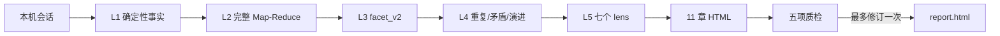

# Codex `/insights`：可分享提示词与实现契约

这份公开说明只复刻分析能力，不复制 Claude Code 的界面或私密内容。Claude Code 已有原生 `/insights`；Codex 使用顶层 Codex-only `insights/` 插件与 `$insights` Skill。

## 直接粘贴给 Codex 的提示词

```text
你现在执行 Codex-only 的 $insights。只分析本机 Codex 的 sessions 与 archived_sessions，不读取云端，不读取其他设备，不修改任何项目仓库。

默认 LANGUAGE=zh-CN、MAX_NEW_SESSIONS=200；只有我明确提供合法 BCP 47 标签或非负上限时才覆盖。排除当前会话、含 $insights 的会话、少于 2 条用户消息或持续不足 60 秒的会话。每轮只选择最近的尚未缓存合格会话。

严格按五层执行：
1. L1：确定性提取日期、project-XX、来源、消息/事件/时长/字符数、工具/错误/文件改动/子代理和并发时段。
2. L2：脱敏后超过 30,000 字符的会话按事件边界切成约 25,000 字符连续块；所有块都判断，再单次 reduce，必须覆盖最后的反馈、错误和结果。
3. L3：每会话生成一个 facet_v2。helper-owned 字段原样复制；模型-owned 字段包括真实目标、目标类别、结果、正负/纠正信号、帮助度、会话类型、摩擦及根因、成功点、摘要和事件锚点。
4. L4：每 50 个 facet 聚合 Repeat、Contradiction、Evolution。凡“规律/常见/反复”至少引用两个不同 opaque session key；单例明确标注，禁止补造结论。
5. L5：独立生成七个 lens：项目领域、协作方式、有效做法、摩擦根因、功能/工作流建议、新用法与未来机会、难忘时刻。只有主代理合成最终报告。

然后生成固定 11 章：总览、项目领域、协作方式、有效做法、摩擦与根因、功能与工作流、AGENTS.md 建议、新用法、未来机会、难忘时刻、方法与覆盖量。

执行一次质检：评分覆盖、证据、隐私、可行动性、增量一致性（1–5）；隐私/证据/增量必须至少 4，否则不提交。覆盖或可行动性低于 4 时，只修订最弱项一次并复评；仍低则显示 concern，不无限循环。

只返回结构化 JSON，不生成 HTML 标签、属性或 CSS。使用同一长驻 helper 的 op 协议：prepare → aggregate → validate_patterns → validate_lenses → validate_quality → commit；每次响应中的 next 模板是下一请求的唯一字段依据。commit 不接收 output_dir 或 prepared。输出为自包含 UTF-8 report.html，默认 lang="zh-CN"，桌面左侧粘性导航、移动端顶部导航、11 个锚点、单一内联 CSS、严格 CSP、零脚本和外部资源。最新报告写入 ~/.codex/usage-data/insights/report.html，归档为 report-YYYYMMDDTHHMMSSZ.html。

报告只显示 opaque session key、日期和 project alias，不显示密钥、Cookie、邮箱、绝对私人路径或大段原文。任何隐私、源变化、锁/CAS、报告冲突或 state-last 事务失败都 fail closed，并说明唯一阻断原因。
```

## 为什么这样分析



## 证据边界

- 官方语义：近期本机会话、跳过极短会话、最多处理此前未分析的会话，并保存报告且消耗额度。
- 本实现观察：facet_v2、25,000 字符分块、六组聚合材料和七个 lens 是 Codex 适配设计，不宣称是 Claude Code 永久接口。
- 隐私边界：脱敏是保守模式扫描，不是匿名性证明；命中已知模式即拒绝持久化。

## 产物与增量

`facets/<opaque-hash>-<source-hash>.json`、`state.json`、`manifest.json`、`report.html` 和时间戳归档均位于 `$CODEX_HOME/usage-data/insights/`。缓存以 opaque session key、源 hash 和 schema 版本校验；源未变化且 facet 合法时不重复调用模型。覆盖恒等式必须满足：`合格 = 已缓存 + 本轮新增 + 尚未处理`。
