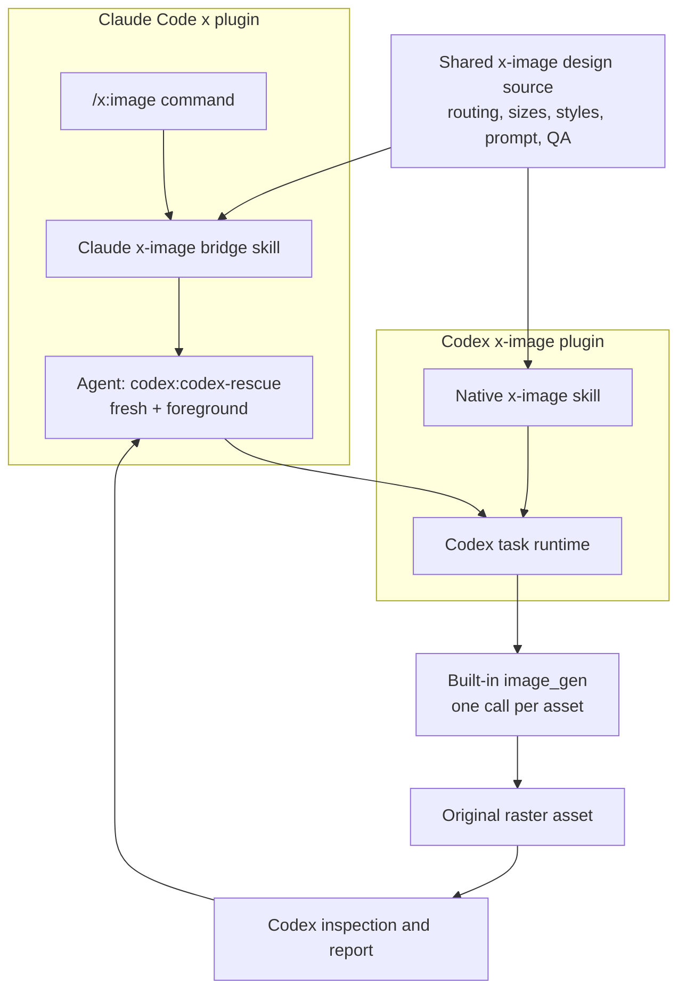
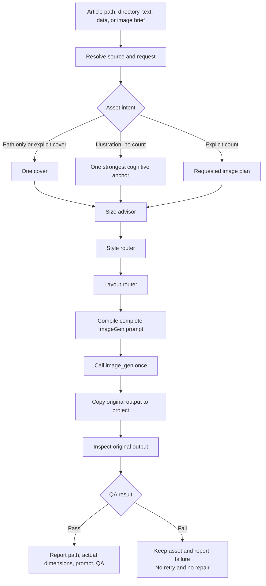

# X Image Dual-Host Design

Date: 2026-07-16  
Status: Approved for implementation planning

## 1. Objective

Replace the Claude-only `/x:cover` workflow with a dual-host `x-image` system that:

- Generates complete X article covers and article illustrations.
- Supports Claude Code through `/x:image`.
- Supports Codex as a native `x-image` skill.
- Uses Codex as the single execution engine for both hosts.
- Calls built-in ImageGen exactly once per requested image asset.
- Produces the entire image, including any requested text, in that single call.
- Performs no crop, resize, text overlay, compositing, re-encoding, or image edit after generation.
- Suggests an appropriate aspect ratio and target dimensions based on intended use.
- Reports the actual generated dimensions rather than promising exact pixel output.

The old `/x:cover` command and `x-cover` skill are removed without a compatibility alias.

## 2. Non-Goals

- Publishing or uploading images to X.
- Editing an existing generated image.
- Automatically retrying a failed or low-quality generation.
- Guaranteeing exact output pixels from built-in ImageGen.
- Falling back to the ImageGen CLI or requiring `OPENAI_API_KEY`.
- Reintroducing Codex versions of `x-follow` or `x-unfollow`.
- Building an HTML, SVG, PIL, ImageMagick, or canvas rendering pipeline.
- Generating a background first and adding text in a second stage.

## 3. Product Boundary

`x-image` owns the complete path from source material to a final raster asset:

1. Read the article, note, data, or user description.
2. Decide whether the output is a cover or article illustration.
3. Select content, ratio, style, and layout.
4. Compile one complete ImageGen prompt.
5. Call built-in `image_gen` exactly once per asset.
6. Copy the original generated file into the requested project location.
7. Inspect and report quality without repairing or regenerating.

For a single image, one command run equals one ImageGen call. When the user explicitly asks for multiple images, each image gets one independent call.

## 4. User Interfaces

### 4.1 Claude Code

Canonical command:

```text
/x:image <source> [cover or illustration intent] [count] [ratio/style notes]
```

Examples:

```text
/x:image article.md
/x:image article.md 生成一张正文解释图
/x:image article.md 生成 3 张插图，统一使用浅色材质风
/x:image article.md 封面，2.5:1，深色终端风
```

Rules:

- A path-only request defaults to one cover.
- Explicit words such as `封面`, `cover`, `插图`, `配图`, `解释图`, or `illustration` override the default.
- Illustration requests default to one strongest cognitive anchor when count is omitted.
- Explicit image counts are honored. Each image consumes one ImageGen call.
- The Claude command does not read the article, plan the image, or call ImageGen itself.
- It invokes the `codex:codex-rescue` agent with a fresh foreground task and returns Codex output verbatim.

### 4.2 Codex

Codex exposes a native `x-image` skill with natural-language triggers including:

- 给这篇 X 文章生成封面
- 给文章生成配图或解释图
- 生成一张指定比例的文章插图
- Create an X article cover
- Create article illustrations from this Markdown file

Codex performs the full workflow directly without creating a nested Codex task.

## 5. Host Architecture



Claude depends on the installed OpenAI Codex plugin. If the rescue agent is unavailable or Codex is unauthenticated, Claude reports that the user must run `/codex:setup`. There is no shell-based `codex exec` fallback owned by the `x` plugin.

## 6. Repository Architecture

The Claude plugin remains `x` because it also contains `x-follow` and `x-unfollow`. Codex receives an independent `x-image` plugin so the removed X account-automation target is not restored.

```text
x/
├── .claude-plugin/
│   └── plugin.json
├── commands/
│   └── image.md
├── skills/
│   └── x-image/
│       └── SKILL.md
└── shared/
    └── x-image/
        ├── references/
        │   ├── intent-routing.md
        │   ├── size-presets.md
        │   ├── style-policy.md
        │   ├── layout-patterns.md
        │   ├── prompt-contract.md
        │   └── qa-checklist.md
        └── styles/
            ├── terminal-tech.md
            ├── editorial-material.md
            └── data-editorial.md

targets/codex/x-image/
├── .codex-plugin/
│   └── plugin.json
├── skills/
│   └── x-image/
│       ├── SKILL.md
│       ├── references/
│       └── styles/
├── scripts/
│   └── install-local-plugin.sh
└── tests/
    └── fixtures/
```

Source-of-truth rules:

- `x/shared/x-image/` is the canonical style, routing, size, prompt, and QA source.
- Claude and Codex `SKILL.md` files are thin host adapters.
- The Codex target uses repository-relative links to the shared source during development.
- The Codex installer dereferences those links while copying into the Codex cache, producing a self-contained installed plugin.
- Runtime bridges contain no long-lived style or prompt logic.

## 7. Runtime Flow



For a multi-image request, the flow runs once per planned asset. If an ImageGen call fails or an asset fails QA, the workflow stops before spending calls on remaining assets. Previously completed assets are preserved and reported.

## 8. Size Advisor

Built-in ImageGen does not expose an exact output-path or size contract to the calling skill. Size is therefore governed through aspect-ratio and composition instructions in the prompt.

Recommended presets:

| Intended use | Ratio | Target dimensions included in prompt |
|---|---:|---:|
| X article cover | 2.5:1 | 2400 × 960 |
| Article hero | 16:9 | 2048 × 1152 |
| Inline explainer | 3:2 | 1536 × 1024 |
| Vertical illustration | 3:4 | 1536 × 2048 |
| Share image | 1:1 | 2048 × 2048 |

Rules:

- User-specified ratio overrides the recommendation.
- A user-specified pixel size is treated as a target prompt instruction, not a guaranteed output contract.
- Custom ratios must not exceed 3:1.
- The final report states the actual generated dimensions.
- No crop, resize, padding, or re-encoding is allowed to force a target size.

## 9. Style Governance

ImageGen does not choose the style freely. `x-image` compiles a complete Style Spec before the tool call.

### 9.1 Precedence

1. Explicit user style request.
2. Asset intent.
3. Content semantics.
4. Default style preset.
5. Global hard constraints, which always apply.

### 9.2 Style Spec

Every style defines:

- Background.
- Base palette and one accent system.
- Visual medium and materials.
- Lighting and shadow behavior.
- Composition and density.
- Text hierarchy and label rules.
- Allowed layout patterns.
- Forbidden visual traits.

Example:

```yaml
id: editorial-material
background: off-white
palette:
  base: neutral-gray
  accent: IKB-blue
medium: restrained-3d-material
lighting: soft-studio
composition: asymmetric-swiss-editorial
text:
  label_length: 2-5
  max_labels: 5
  high_contrast: true
avoid:
  - glow
  - gradient-blobs
  - watermark
  - fake-ui
  - paragraph-text
  - multiple-focal-points
```

### 9.3 Built-In Presets

#### `terminal-tech`

Use for technology covers, open-source projects, and product engineering topics.

- Deep navy background.
- Cyan or gold accent.
- Crisp solid typography.
- Terminal and engineering motifs.
- No neon glow or fog.

#### `editorial-material`

Use for explainers, processes, education, humanities, and general article illustrations.

- Off-white background.
- Restrained Swiss editorial layout.
- Soft 3D material objects.
- One accent color.
- Short Chinese labels attached to objects and flows.

#### `data-editorial`

Use for rankings, trends, metrics, comparisons, and chart-led images.

- Data remains the dominant visual.
- Exact categories, values, units, and order are listed in the prompt.
- Material depth must not distort axes or marks.
- Scene elements are secondary and must not block data.

### 9.4 Consistency Across a Set

All assets in one request lock:

- Style ID.
- Accent color.
- Material and lighting.
- Label treatment.
- Composition density.

A custom user style becomes a task-local Style Spec. It does not modify the built-in presets.

## 10. Prompt Contract

The final prompt is compiled before ImageGen and includes:

```text
Use case
Asset type
Primary request
Source-derived content
Exact visible text
Aspect ratio and target dimensions
Style ID and full Style Spec
Layout pattern
Composition and safe margins
Data or reference accuracy requirements
Global constraints
Avoid list
Single-call instruction
```

Hard requirements:

- All visible text is quoted verbatim.
- Long article text is never placed inside the image.
- Covers use one primary visual hook.
- Explain diagrams use at most five short labels unless the user explicitly requests otherwise.
- Data values, units, category order, and axis semantics are enumerated.
- No extra text, logo, watermark, fake UI chrome, or production-process wording.
- The prompt explicitly states that the entire final asset must be generated in one call.

## 11. ImageGen Contract

For each asset:

- Use the default built-in ImageGen path.
- Call `image_gen` exactly once.
- Do not call ImageGen edit.
- Do not automatically retry.
- Do not generate intermediate assets.
- Do not invoke ImageGen CLI or require an API key.
- Copying or moving the original output is allowed.
- Reading metadata and visually inspecting the original output is allowed.
- Image modification after generation is forbidden.

If QA fails, the generated file is retained and reported as failed. A new generation requires a new explicit user request.

## 12. Output Contract

Default article output:

```text
<article-directory>/images/
├── cover.png
├── illustration-01-<slug>.png
├── illustration-02-<slug>.png
└── ...
```

Rules:

- A user-provided destination takes precedence.
- When the source is a file, default to an `images/` directory beside that file.
- When the source is a directory, default to `<source-directory>/images/`.
- When the source is direct text, data, or an image brief without a backing file or directory, default to `<current-working-directory>/images/`.
- Existing files are never overwritten.
- Name collisions use `-v2`, `-v3`, and so on.
- The project contains only final original ImageGen outputs.
- No raw, thumbnail, crop, or post-processing directories are created.
- The final response reports:
  - Saved path.
  - Actual dimensions when available.
  - Style ID.
  - Final prompt.
  - QA result.
  - Whether the run came from native Codex or Claude through Codex Rescue.

## 13. Failure Handling

| Failure | Behavior |
|---|---|
| Claude cannot find Codex Rescue | Stop and instruct the user to run `/codex:setup` |
| Codex cannot find `x-image` | Stop and provide the local plugin installation instruction |
| Source path is missing or ambiguous | Ask one concise source-location question |
| ImageGen is unavailable or rate-limited | Stop without fallback or retry |
| Generated asset fails semantic or visual QA | Preserve it, report failure, do not regenerate |
| Multi-image asset fails | Stop remaining calls and report completed and failed items |
| Destination exists | Create a versioned sibling filename |

The system never uploads, publishes, edits the article, or performs X account actions.

## 14. Migration

Claude `x` plugin:

- Remove `x/commands/cover.md`.
- Remove `x/skills/x-cover/`, including `cover-gen.sh`.
- Add `x/commands/image.md`.
- Add the Claude `x-image` bridge skill.
- Add the shared routing, size, style, prompt, layout, and QA files.
- Update README, plugin description, marketplace description, and changelog.
- Bump the Claude `x` plugin to `2.0.0` because `/x:cover` is removed.

Codex:

- Add independent `targets/codex/x-image/`.
- Register `x-image` in `.agents/plugins/marketplace.json`.
- Add the local installer and self-contained cache build.
- Use version `0.1.0` for the new Codex plugin target.

Cache:

- Claude changes are synchronized through the existing cache sync process.
- Codex changes are installed through `targets/codex/x-image/scripts/install-local-plugin.sh`.

## 15. Verification Strategy

### 15.1 Static and Structural Tests

Verify:

- Claude command is `/x:image`.
- `/x:cover` and `x-cover` no longer exist.
- Claude bridge references `codex:codex-rescue`.
- Claude bridge requests a fresh foreground Codex task.
- Codex marketplace contains `x-image`.
- Codex target contains a valid `.codex-plugin/plugin.json`.
- Shared style and reference links resolve.
- Installed Codex cache is self-contained.
- Prompt rules contain the one-call and no-post-processing requirements.
- No production script invokes `magick`, `sips`, SVG, HTML rendering, or raw `codex exec`.

### 15.2 Live Codex Acceptance

Run from Codex:

1. X article cover using the 2.5:1 recommendation.
2. 16:9 article hero.
3. 3:2 labeled explainer.
4. 3:4 vertical article illustration.
5. Explicit custom style.
6. Two-illustration request.

For every asset, acceptance evidence must show:

- Exactly one `image_gen` tool call.
- Zero ImageGen edit calls.
- Zero image modification commands.
- Original output copied into the project.
- Actual path and dimensions reported.
- Style ID and final prompt reported.
- Text, subject, watermark, composition, and style QA recorded.

### 15.3 Claude Bridge Acceptance

Verify that `/x:image`:

- Invokes `codex:codex-rescue` once.
- Uses a fresh foreground task.
- Delegates the complete workflow to Codex.
- Returns Codex output verbatim.
- Does not independently inspect, modify, or regenerate the image.

Live visual generation is accepted primarily in Codex. Claude acceptance verifies only the bridge and end-to-end delegation path.

### 15.4 Development Quality Gates

Implementation follows strict test-driven development:

1. Write a failing test for one required behavior.
2. Run it and confirm it fails because the behavior is missing.
3. Write the minimum implementation needed to pass.
4. Run the focused test and the full regression suite.
5. Refactor only while all tests remain green.

The release gates are:

| Gate | Evidence | Release behavior |
|---|---|---|
| G1 Requirement traceability | Every requirement maps to at least one test case | Block if any requirement is uncovered |
| G2 TDD evidence | Each production behavior has a recorded RED then GREEN result | Block if a test was added only after implementation |
| G3 Static contracts | Commands, manifests, shared source, forbidden tools, and output rules pass | Block on any failure |
| G4 Host integration | Claude bridge and Codex plugin installation/discovery pass | Block on any failure |
| G5 Live Codex acceptance | Required scenarios use real built-in ImageGen | Block on any P0 or P1 issue |
| G6 Regression and review | Full suite, diff review, and spec mapping pass | Block until clean |

### 15.5 Planned Automated Test Layout

```text
targets/codex/x-image/tests/
├── test_structure.py
├── test_claude_bridge.py
├── test_codex_plugin.py
├── test_shared_source.py
├── test_prompt_contract.py
├── test_style_contract.py
├── fixtures/
│   ├── tech-article.md
│   ├── data-article.md
│   ├── explainer-article.md
│   └── humanities-article.md
└── acceptance/
    ├── cover-2_5x1.md
    ├── hero-16x9.md
    ├── explainer-3x2.md
    ├── vertical-3x4.md
    ├── custom-style.md
    └── multi-image.md
```

Automated coverage includes:

- Path-only input defaults to one cover.
- Illustration input without a count defaults to one cognitive anchor.
- Explicit multi-image counts create one plan item per asset.
- File, directory, and direct-text inputs select the correct output directory.
- Existing filenames create versioned siblings instead of overwriting.
- Ratios over 3:1 are rejected with a valid recommendation.
- Claude invokes Codex Rescue once and does not use raw `codex exec`.
- Codex plugin metadata and cache installation are valid.
- Shared style and reference links resolve and install as self-contained files.
- User style overrides automatic routing.
- Batch assets lock style ID, accent, material, lighting, and label treatment.
- Prompt contracts contain exact text, style, ratio, one-call, and no-post-processing requirements.
- Production files contain no ImageMagick, `sips`, SVG, HTML renderer, ImageGen edit, automatic retry, or CLI fallback path.
- A failed asset stops remaining multi-image calls and preserves completed outputs.

### 15.6 Live Acceptance Evidence

Each live acceptance record includes:

```text
Codex task or thread
Input fixture
Final prompt
Style ID
image_gen call count
ImageGen edit call count
Image modification command count
Saved output path
Actual dimensions
Content QA
Style QA
Final PASS or FAIL
```

The live scenarios are:

| Case | Scenario | Primary evidence |
|---|---|---|
| AC-01 | 2.5:1 technology cover | `terminal-tech`, Chinese title, single focal point |
| AC-02 | 16:9 article hero | Clear composition and intended ratio |
| AC-03 | 3:2 labeled explainer | Short correct labels and relationships |
| AC-04 | 3:4 vertical illustration | `editorial-material` adherence |
| AC-05 | Data-led article image | Exact values, units, order, and `data-editorial` |
| AC-06 | Two-illustration request | Two calls total, one per asset, locked style |

Visual issue severity:

- **P0, release blocking:** more than one ImageGen call per asset, any image post-processing, wrong visible text or data, invented data, watermark, prompt leakage, severe crop, or a non-original final asset.
- **P1, release blocking:** clear style mismatch, unreadable intended display size, missing focal point, misleading data presentation, or inconsistent batch style.
- **P2, advisory:** minor spacing or decorative differences that do not affect understanding.

If a live case fails, development may revise the prompt or style contract and run a new acceptance task. The production behavior still forbids automatic retry within one user task.

## 16. Acceptance Criteria

The design is complete when:

- Claude exposes `/x:image` and no `/x:cover`.
- Codex discovers the native `x-image` skill.
- Both entry points use the same routing, size, style, prompt, and QA definitions.
- Claude delegates through Codex Rescue rather than raw `codex exec`.
- Every generated asset uses exactly one built-in ImageGen call.
- No generated image is modified after the ImageGen call.
- Covers and article illustrations both work.
- Ratio and size recommendations work without exact-pixel promises.
- Style selection is explainable, repeatable, and consistent across a set.
- Codex live acceptance results are recorded for all required scenarios.
