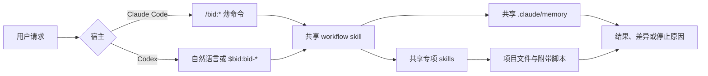

# Bid Dual-Host Plugin Design

Date: 2026-07-18  
Status: Approved for specification review

## 1. Objective

把现有 Claude Code `bid` 插件扩展为 Claude Code 与 Codex 共用的双宿主插件，同时保留一份业务技能源码。

完成后：

- Claude Code 继续使用 `/bid:init`、`/bid:meeting`、`/bid:sync`、`/bid:handoff`、`/bid:review`、`/bid:status`。
- Codex 可以通过自然语言或 `$bid:bid-init`、`$bid:bid-meeting`、`$bid:bid-sync`、`$bid:bid-handoff`、`$bid:bid-review`、`$bid:bid-status` 进入相同流程。
- 原有 10 个专项 skills 同时服务两个宿主。
- Claude 与 Codex 共享同一份项目口径档案，不产生两套 memory。
- 插件安装到本机现有 `local-build-your-system` Codex marketplace。

## 2. Reference Architecture

本设计参考 `obra/superpowers` 的多宿主结构：

- 同一个插件目录同时提供 `.claude-plugin/` 与 `.codex-plugin/`。
- 所有宿主共享根目录 `skills/`，不复制宿主专属技能树。
- 宿主差异通过 manifest、薄入口和工具映射 reference 隔离。
- Codex 插件测试覆盖 manifest、marketplace、打包内容及宿主兼容性。

参考：

- <https://github.com/obra/superpowers>
- <https://github.com/obra/superpowers/blob/main/.codex-plugin/plugin.json>
- <https://github.com/obra/superpowers/blob/main/skills/using-superpowers/references/codex-tools.md>

## 3. Design Decision

采用“单一技能源码、多宿主外壳”，不创建 `targets/codex/bid`。

```text
build-your-system/
├── .agents/plugins/marketplace.json
└── bid/
    ├── .claude-plugin/plugin.json
    ├── .codex-plugin/plugin.json
    ├── commands/                    # Claude Code 薄入口
    ├── skills/                      # 双宿主唯一技能真源
    ├── tests/                       # 双宿主结构与契约测试
    ├── scripts/install-codex-local.sh
    ├── README.md
    └── CHANGELOG.md
```

不采用独立 Codex target 的原因：

- 10 个专项 skills 内容已经基本与宿主无关，复制会立刻制造维护分叉。
- 六个流程 command 可以提升为共享 workflow skills；Claude command 只需保留参数入口。
- `obra/superpowers` 已验证共享 skills + 多 manifest 是 Codex 原生插件的可行结构。

## 4. Shared Skill Architecture

### 4.1 Existing Domain Skills

保留并复用以下 10 个专项 skills：

- `bid-playbook`
- `single-source-sync`
- `bid-costing`
- `bid-scheduling`
- `adversarial-review`
- `deai-writing`
- `diagram-pdf-pipeline`
- `prototype-handoff`
- `bid-research`
- `presales-tactics`

只做 Codex 兼容所必需的修改：

- frontmatter 统一为 `name` 与 `description`。
- 把未映射的 Claude 专属工具名改为宿主中性动作，或明确指向宿主适配 reference。
- 保留方法论、红线、脚本和验收标准，不做业务语义重写。

### 4.2 Workflow Skills

新增 6 个共享 workflow skills，作为流程正文的唯一真源：

| Shared skill | Claude Code 入口 | Codex 显式入口 |
|---|---|---|
| `bid-init` | `/bid:init` | `$bid:bid-init` |
| `bid-meeting` | `/bid:meeting` | `$bid:bid-meeting` |
| `bid-sync` | `/bid:sync` | `$bid:bid-sync` |
| `bid-handoff` | `/bid:handoff` | `$bid:bid-handoff` |
| `bid-review` | `/bid:review` | `$bid:bid-review` |
| `bid-status` | `/bid:status` | `$bid:bid-status` |

每个 workflow skill：

- 从对应 `commands/*.md` 吸收完整流程、护栏和常用用法。
- 从当前用户请求与会话上下文获取参数，不依赖 `$ARGUMENTS`。
- 明确引用需要的专项 skill。
- 只在真正缺少 blocking 输入时暂停询问用户。

原 `commands/*.md` 改为 Claude Code 薄入口：保留 description、argument-hint 和 `$ARGUMENTS`，只负责激活同名 workflow skill 并透传参数，不再复制流程正文。

## 5. Host Adaptation

新增共享宿主适配 reference，集中描述差异：

| 意图 | Claude Code | Codex |
|---|---|---|
| 加载专项 skill | Skill 工具或命令路由 | 自动触发或 `$bid:<skill>` |
| 文件查找 | Glob/Grep/Read | `rg`、只读 shell 或对应文件工具 |
| 文件修改 | Write/Edit | `apply_patch` |
| 命令执行 | Bash | shell execution |
| 并行独立审校 | Agent/Task | Codex multi-agent；不可用时独立顺序 pass |
| 用户输入 | Claude 原生交互 | Codex 原生交互 |

共享 skills 描述“动作与约束”，宿主 reference 描述“用哪个工具完成”。宿主专属工具名不得散落成未解释的强依赖。

## 6. Project Memory Compatibility

不创建 `.codex/bid-memory/`，也不迁移现有 memory。

原因：

- `.claude/memory/` 已被现有 bid 流程和用户项目使用。
- 改成 Codex 专属路径会让同一项目在两个宿主下形成两份口径档案。
- 目录名不影响 Codex 通过文件工具显式读写。

因此共享 skills 使用语义名称“项目 memory”，宿主适配 reference 规定当前物理路径仍为：

```text
.claude/memory/
```

Codex 不假设该目录会自动注入上下文；`bid-init`、`bid-meeting`、`bid-sync`、`bid-status` 必须按流程显式读取或维护它。

## 7. Codex Manifest and Installation

`bid/.codex-plugin/plugin.json`：

- name 与目录一致，为 `bid`。
- 使用严格 semver。
- `skills` 指向 `./skills/`。
- 提供 Codex UI 所需的 interface metadata。
- 不声明不存在的 apps、MCP 或 hooks。

本机安装流程：

1. 建立 `~/plugins/bid -> /Users/jliu/Projects/build-your-system/bid` 符号链接。
2. 在 `~/.agents/plugins/marketplace.json` 追加 `bid`，来源保持 `./plugins/bid`。
3. 运行 `codex plugin add bid@local-build-your-system`。
4. 用新 Codex task 验证技能索引刷新。

`scripts/install-codex-local.sh` 必须幂等，并保留 marketplace 中所有无关条目。若同名路径或条目指向其他来源，脚本停止并报告，不覆盖未知目标。

## 8. Runtime Flow



宿主差异只改变入口和工具选择，不改变流程顺序、业务红线或交付口径。

## 9. Safety and Error Handling

- `bid-status` 全程只读；发现漂移只报告。
- `bid-review` 不自动 commit。
- `bid-sync` 在写句柄、手改回捕或事实源不明确时停止。
- `bid-handoff` 缺合规定稿或真实视觉素材时停止。
- `bid-init` 目标目录非空时先审计并只给迁移预览。
- 安装脚本不覆盖未知 symlink、未知 marketplace 来源或现有缓存。
- 任何 destructive action 都必须保持原插件约定的预览和用户确认边界。

## 10. Verification Strategy

### 10.1 RED Baseline

在修改前记录当前失败事实：

- `bid` 没有 `.codex-plugin/plugin.json`。
- 个人 Codex marketplace 没有 `bid`。
- 六个流程只存在于 Claude commands，Codex 无法作为 skills 加载。
- skill 文本包含未映射的 `$ARGUMENTS`、`/bid:*`、Claude 工具或宿主假设。

### 10.2 Automated Checks

新增测试验证：

- Claude 与 Codex manifest 名称、版本和共享 skills 路径一致。
- 16 个 skill 目录完整，frontmatter 可解析且无非法字段。
- 6 个 Claude commands 分别路由到正确 workflow skill。
- 所有 workflow skill 都包含关键护栏与专项 skill 依赖。
- 未映射的 Claude 专属语法扫描为零。
- 四个附带计算/扫描脚本可执行其现有 self-test 或最小 smoke test。
- 安装脚本在临时 HOME fixture 中可重复运行且不破坏其他 marketplace 条目。

### 10.3 Integration Checks

- Codex plugin validator 通过。
- `codex plugin list` 显示 `bid@local-build-your-system` 为 installed、enabled。
- 新 task 中 16 个 `bid:` skills 可发现。
- 至少验证 `bid-status` 的只读路径和 `bid-init` 的安全目录分支。

## 11. Documentation

更新 `bid/README.md`，包含：

- Claude Code 与 Codex 的安装方式。
- 六个流程在两端的调用对照表。
- 10 个专项 skills 的自然语言触发示例。
- 推荐工作流：init → meeting → sync → review → handoff/status。
- 附带脚本依赖与 macOS 环境说明。
- 项目 memory 仍位于 `.claude/memory/` 的兼容性说明。
- 更新、卸载和“新 task 才会刷新技能索引”的说明。

## 12. Non-Goals

- 不创建 `targets/codex/bid`。
- 不把业务方法论重写成两套宿主版本。
- 不改变原有报价、排期、合规、审校或交付红线。
- 不新增 MCP、App connector、hook 或远程服务。
- 不发布到官方 Codex marketplace。
- 不自动提交、推送或创建 PR。
- 不迁移用户现有项目目录或 memory。

## 13. Success Criteria

满足以下条件才算完成：

- Claude Code 原六个 `/bid:*` 入口继续存在并路由到共享技能。
- Codex 安装后能发现 16 个 `bid:` skills。
- 双宿主共享 `bid/skills/`，不存在 Codex 技能副本。
- 双宿主读取同一份项目 memory。
- manifest、结构、脚本和安装测试通过。
- `codex plugin list` 确认插件已启用。
- 中文使用说明覆盖安装、调用、流程、边界和更新。
