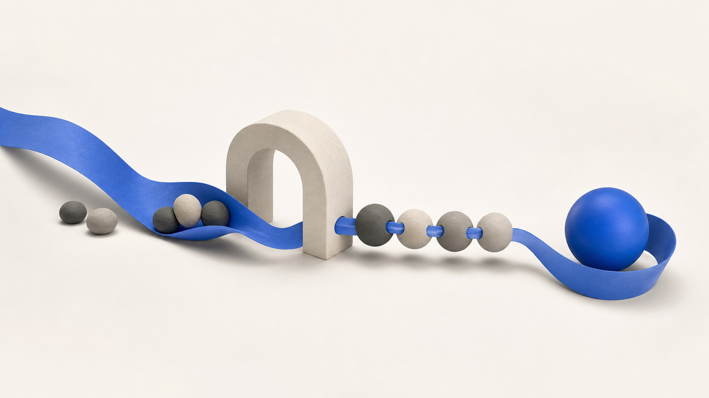
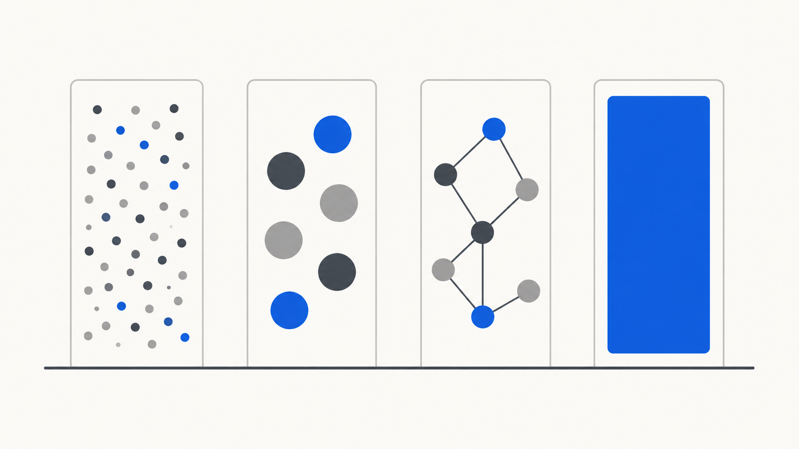
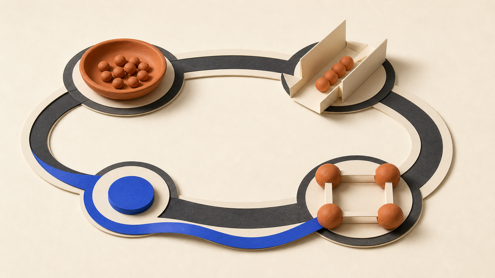
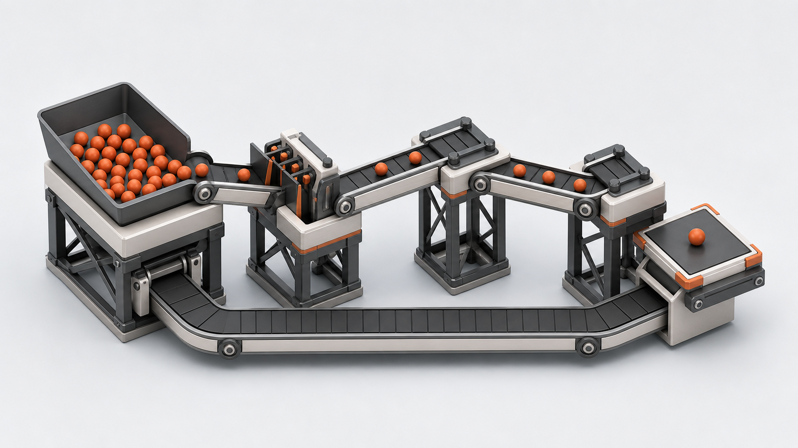

# X Image Style Previews

These versioned static previews use zero generation calls. Every image uses the same neutral benchmark—capture, clarify, connect, and express—so differences primarily reflect the preset rather than the subject.

A preview is a style reference, not a pixel-level promise. Image generation remains stochastic, while the preset controls the repeatable visual constraints.

| Style ID | 中文名 | 适用场景 | Preview |
|---|---|---|---|
| `terminal-tech` | 终端科技 | 技术封面、开源项目、开发者工具 |  |
| `editorial-material` | 编辑材料 | 通用解释图、教育、人文、单一流程 |  |
| `data-editorial` | 数据编辑 | 排名、趋势、指标、比较 |  |
| `tactile-systems` | 纸张材料系统图 | 因果回路、流程地图、运营模型 |  |
| `isometric-systems` | 等距机械装置 | 系统架构、管线、反馈机制、空间流程 |  |
